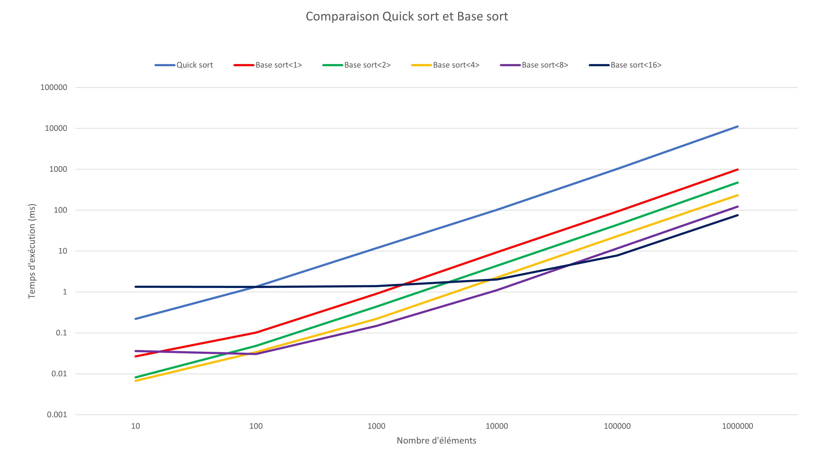

# L3 - Tris

## Auteurs

Courbat Guillaume - Streckeisen Jarod - Van Hove Timothée

## Introduction

### But

Dans ce laboratoire, nous allons nous familiariser avec des algorithmes de tris vu en
cours d'ASD: le tri par base, le tri rapide ainsi que le tri comptage.

Nous devons implémenter les algorithmes de ces tris et vérifier que leur
implémentation fonctionne correctement. Nous devons également les tester sur
différents types d'entier non-signés. Et pour finir, nous allons devoir calculer le
temps d'exécution de ces algorithmes de tris et les comparer.

### Definitions

#### Tri rapide:

Le tri rapide n'est pas stable. Il a une complexité linéarithmique O(n*log(n)) et
dans le pire des cas une complexité en O(n^2). Il est fondé sur la méthode de
conception <a href="https://fr.wikipedia.org/wiki/Diviser_pour_r%C3%A9gner_(informatique)">
diviser pour régner</a> , qui utilise un algorithme de partition pour découper le
problème en plusieurs sous-problèmes faciles à résoudre (dans notre cas la
comparaison de valeurs). Nous devons implémenter sa version semi-récursive avec un
pivot aléatoire.

#### Tri par base:

Le tri par base est un tri stable. Il a une complexité en O(d(n+b)). D étant le
nombre d'itérations du tri comptage, n le nombre d'éléments et b le nombre de valeurs
distinctes possibles. Sa stabilité lui vient de la fonction tri comptage qui est
elle-même stable. Ce tri a une particularité: il n'utilise aucune comparaison.

### Déroulement des tests

Voici les étapes principales des tests pour le graphique:

1. Générer un tableau non trié avec le nombre d'éléments voulu.
2. Enregistrer le temps
3. Exécuter la fonction de tri
4. Enregistrer le temps à nouveau
5. Faire la différence entre le deuxième et le premier temps.

Afin d'avoir un résultat plus précis, pour chaque fonction de tri, nous avons
effectué dix fois le calcul, additionné les dix temps et nous les avons divisés par
dix pour avoir la moyenne.

Concernant le nombre d'éléments dans nos tableaux, nous avons choisi les 6 valeurs
suivantes : 10, 100, 1'000, 10'000, 100'000 et 1'000'000. Cela nous permet d'avoir
une grande plage de valeurs suffisamment espacée pour avoir une différence de temps
significative. Cela nous permet aussi d'utiliser des échelles logarithmiques sur les
graphiques. Le type utilisé pour tous ces éléments est: unsigned int.

## Résultats

Remarques: 
1. Durant la discussion, nous allons utiliser la notation base<X> pour dire
que le tri par base a été fait en utilisant la base X. Ex: base<4> = tri par base en
base 4. 
2. En utilisant un pivot aléatoire pour le tri rapide et en utilisant des 
   tableaux générés aléatoirement, nous nous trouvons en termes de complexité dans 
   un cas général et non le pire. 

### Tri rapide:

Nous pouvons remarquer d'emblée que le tri rapide (quick sort) est plus lent. Il est
seulement plus rapide que le tri par base<16> quand il ne dépasse pas environ 100
éléments. Ceci est peut-être dû au fait qu'il effectue énormément de comparaisons.

Nous pouvons constater que la droite du tri rapide correspond bien à sa complexité
théorique de O(n*log(n)).

### Tri par base:

On constate que le tri par base est plus rapide dans presque toutes ces versions que
le tri rapide.

Nous remarquons que selon les bases données, ce tri est substantiellement plus
rapide. C'est normal, plus la base est petite, plus il y aura de tri comptage. Donc
plus le tri prendra de temps. Cependant, ceci est à mettre en contraste avec le
nombre de données triées et leur valeur maximum. En effet, On constate que pour le
tri base<8> et base<16>, on observe un plateau sur leur droite de tendance. Ceci est
du au fait que chaque élément contenu dans le vecteur est représentable par une seule
base. Dans le cas du tri base<8>, tant que les valeurs à trier ne dépassent pas 255
(2^8 - 1), le tri par base<8> utilise une seule fois le tri comptage. Il en va de
même pour le tri base<16>, tant que les valeurs ne dépassent pas 65'355
(2^16-1), l'algorithme ne fera aussi qu'un seul tri comptage. On peut étendre cette
même observation à toutes les bases même si c'est négligeable pour les plus petites.

Il faudrait donc choisir le type de tri par base en fonction du nombre de données
ainsi que de leur valeur maximum.

1. le tri base<4> serait à utiliser pour trier des nombres entre [1, 255]
2. le tri base<8> serait à utiliser pour trier des nombres entre [256, 65'355]
3. le tri base<16> serait à utiliser pour trier des nombres entre [65'355, 2^32 - 1]

Le tri par base a une complexité en O(d(n+b)). Les droites de tendances sur le
graphique correspondent à la théorie.

## Conclusion

Pour terminer, nous avons eu du plaisir à faire ce laboratoire. Il nous a permis de
mieux comprendre le fonctionnement d'algorithmes de tri performants et leur mise en
pratique. Maintenant, nous sommes plus aptes à sélectionner un bon algorithme de tri
pour une situation donnée.

